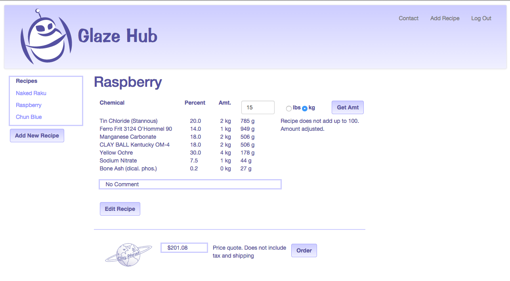
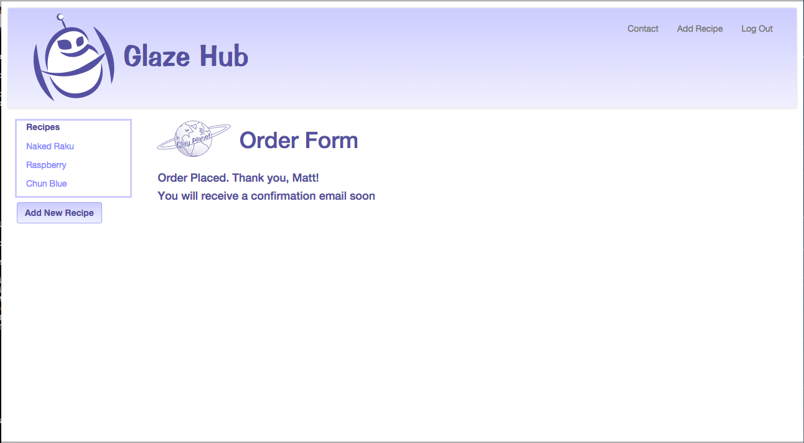
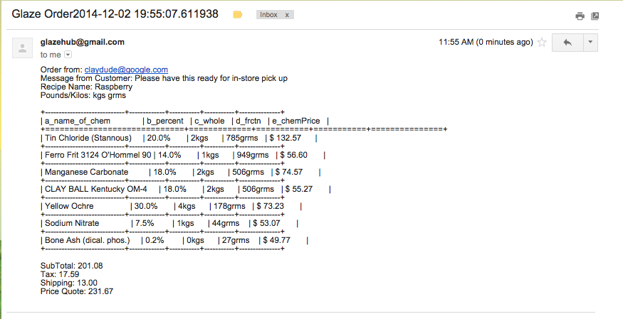

GlazeHub
========

My Glaze Calculator Project

GlazeHub is a specialized tool for ceramic artists to calculate and save glaze recipes.
Glaze testing, notetaking, getting price quotes of mixed glazes as well as ordering from Clay Planet
is made simple with this app.

When a user creates a free account, they can then save their most-used recipes or test
recipes as well as make notes.

This is a Flask app. Back end is written in Python, SQLite and SQLAlchemy for the ORM. Front end makes use of HTML, CSS, JavaScript, JQuery and Bootstrap.

GlazeHub started out as an idea in January 2014. After a discussion with some ceramic friends about a glaze calculator, we discovered that there is really only one. (http://glazecalculator.com/). It's a neat little site, but there were a few things we or rather I wanted to change.

1. Allow the user to decide how many components were in the glaze.
2. Allow the user to enter in a batch size (kilos or pounds) and the app would calculate the amount of each chemical needed.
3. Allow the user to order their custom glaze from Clay Planet, a clay supply store in Santa Clara

A few things helped, mostly, the other members of this discussion own Clay Planet and they graciously allowed me access to their chemical list and the prices attached to them. (WARNING: Because this list is confidential and not saved in this github repository, GlazeHub will not run on any other machine but my own for right now.) Other things that helped were: access to other potters who were interested in using this tool and provided encouragement, experienced glaze mixers who helped me with how to write the calculation formula and a guideline/framework for a minimum viable product.

So here was the framework for that product:

1. Create a calculation page where users could add or subtract components - does not require log in
2. Allow users to save their recipes, but protect them so that they cannot be shared or seen by other users - log in required.
3. Show a price quote from Clay Planet that includes chemical (price rate dependant on weight) and handling
4. Add tax and shipping
5. Send an email to Clay Planet when the customer is ready to order that includes the recipe, weight needed for each chemical, shipping, tax and price quote.

Data Model
========
The first step was to set up my data model using Python and sqlite. Each object was written as a class and then class particuar methods were written to retrieve data from that class.

The hardest part for me here was changing the way I thought of a recipe as being the "binding" table. I thought the "one-to-many" should have been set up as one recipe with many components. However, that started getting very complicated by becoming more of a "many-to-many" relationship. After a discussion with and help from an advisor(Thanks, Joel!), I came up with the model (see image above).

The chemical object has an id, name and price rates from a quarter pound to 500 lbs. User table object has an id, email, user name and password. Recipe object has an id, reipe name, user id(backref to the User object and user notes. The component object is the 'binding' object in that it relates the chemicals to a recipe as well as a percentage of each component or chemical for that particular recipe.

Once the data model was set up in Python, I used SQLAlchemy queries to write up class methods for retrieving prices, ids, recipe names and such from each table.

When a user adds a recipe, the recipe and components tables are updated. The chemical table should never be touched by the users.

Design/UX flow
========
Once the data model was created and set up, it was time to start with some basics. First was the index and login pages:

Oh, I created the GlazeHub logo as well. Playing on the Clay Planet theme, the GlazeHub logo is an alien in a spaceship, the font is Impress BT (also used by Clay Planet). The purple is similar in shade and tone to the blue of Clay Planet logo. The GH logo itself was done in Adobe Illustrator and exported as an SVG. Future versions will have the logo as a PNG so that it has more of a cross platform compatibility and so that the Impress BT font will be seen in all browsers.

This page allows a user to calculate their recipe. However, they are not able to save their recipe nor order the glaze from Clay Planet. This page is basically the same thing as the Add Recipe page that logged in users see.

Glazes have different numbers of components. I didn't want to hard code the number of components a user can add, so I created a hidden template that would cloned every time the "Add Component" button was clicked or deleted whenever the "Delete" button was clicked. Both of these buttons are controlled by an external JavaScript script. They interrupt the "Get Size" form action and allow for user modification.

When a user logs in, this is what they will see. On the extreme left, users will see a list of the recipes they have saved before. This list will appear on every page on GlazeHub that a user goes to while logged in. The center part is a message area where I can communicate with users about the current status of GlazeHub or if there have been price updates from Clay Planet.

This is what a saved recipe looks like. From here, a user can change the batch size and get it calculated in either pounds or kilograms. Switching between unit systems needs a click on the Get Size button in order to get the new system calculation. Once a user has entered a batch size and clicked "Get Size", a price quote from Clay Planet not including shipping and tax as well as an "Order" button will appear.

If a user wants to edit their recipe, they can just click on the edit recipe button.

From this page, a user can add or delete components, change the name of the recipe and add or delete or edit comments. WARNING: this will update a recipe. It will completely overwrite the previous version.

A user can also delete their recipe from here as well. Deleting will remove the recipe and its components entirely from the recipe and component tables.

Once the user has finished editing their glaze recipe and added in a batch size, they can click the "Order" and come to the above page. A user can review their recipe, see a price quote with tax and shipping itemized, write a message to Clay Planet, and order the glaze. GlazeHub uses the login email of a user as an identifier and will include the user's email address in the email it generates for the order.

Once the user hits the "Send Email" button, this page comes up informing the user that the email has been sent and soon, they should receive a confirmation email from Clay Planet.

This is a screen cap of what the email from GlazeHub looks like to Clay Planet. Information included is:recipe, unit system (kilos/pounds), amount of each chemical required, chemical price, subtotal(note: exact surcharge is shown and is already added into the subtotal.), tax, shipping and total price quote

Future Plans
========
GlazeHub will be deployed after a period of testing. Glazehub is now deployed at: www.glazehub.com.

Future versions will have Facebook/Twitter or other social media log in. I also will add an upload photo feature. This will aid potters/artists who wish to keep a record of test glazes.

If GlazeHub does indeed become a 'hub' for glaze calculation and ordering of glazes from Clay Planet, I hope to implement PayPal or other electronic payment formats.
